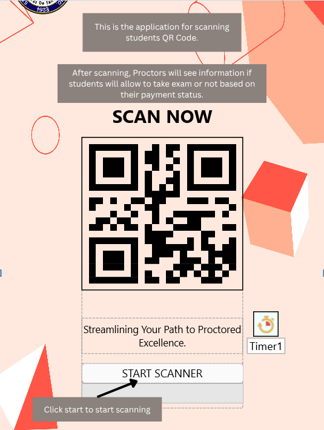
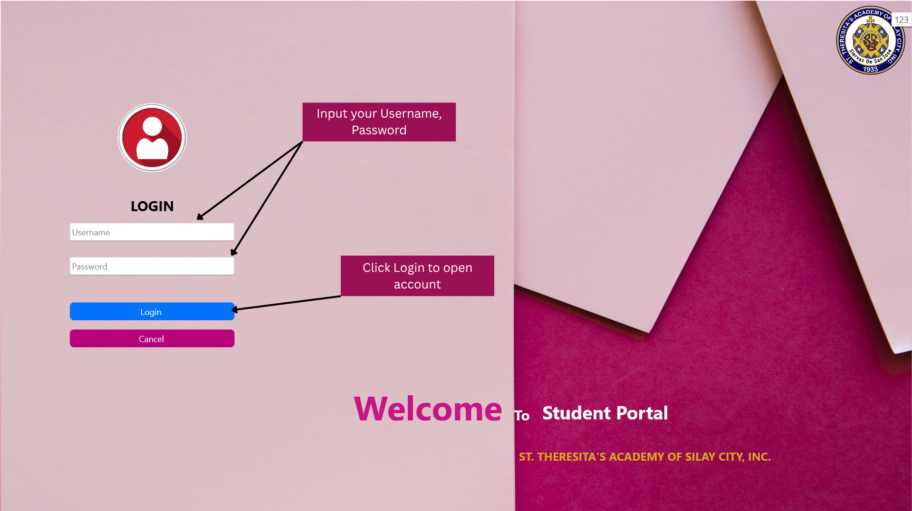
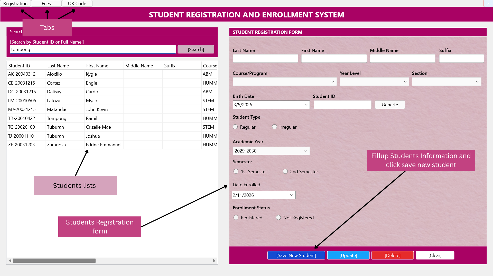
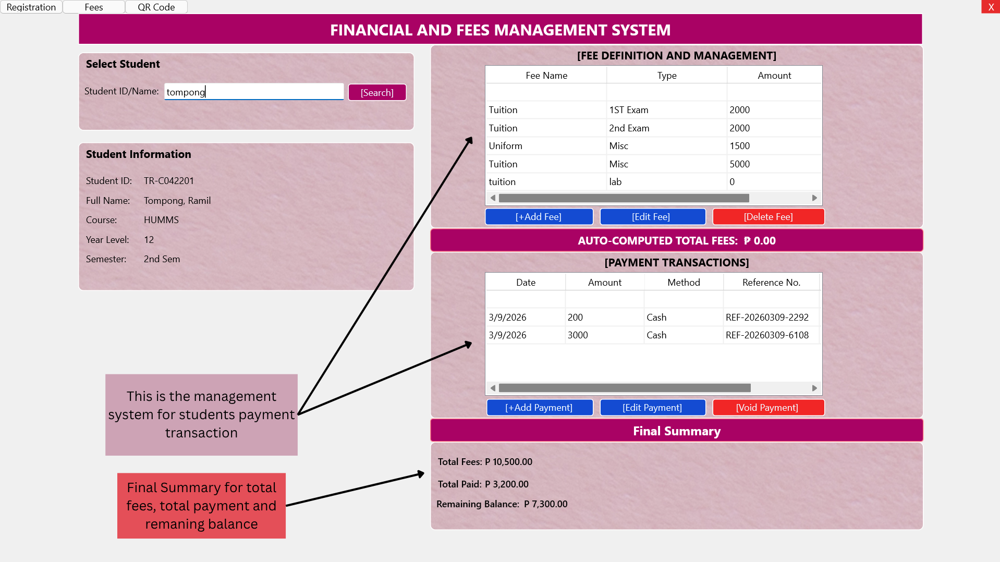
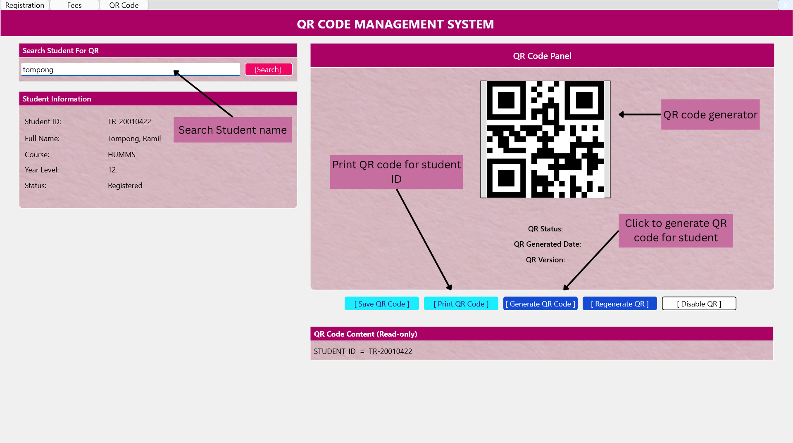
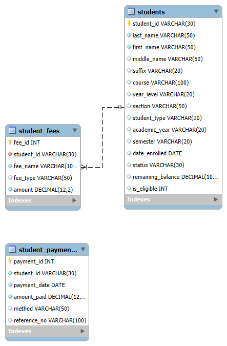

# Student ID with QR Code for Exam Payment Verification and Monitoring Using C4.5 Algorithm

## Project Overview
This repository contains the full-stack architecture, source files, and database blueprints for an automated hardware-to-software verification gate system. Designed to optimize academic clearance operations, the system replaces manual paperwork with a secure, machine-learning-driven data pipeline that processes student financial states in real-time to control exam eligibility gates.

## System Topology & Multi-Language Pipeline
The system is engineered as a cross-platform integration tying physical hardware tokens to an analytical backend:

## Team Credits & Role Architecture
This system was built by a collaborative 3-person engineering team:
* **Joshua Abelay Tuburan (Lead Database Architect):** Designed, normalized, and deployed the MySQL relational database layer; engineered high-precision financial tracking systems and relational data piping.
* **UI/UX Developer:** Engineered the administrative desktop suite and edge scanning client interfaces using Delphi.
* **Backend Developer:** Developed the algorithmic logic pipeline and decision routing using Python and the C4.5 framework.
1. **Management & Data Ingestion (Delphi):** A high-performance desktop administration suite handles student registration, financial ledger management, and programmatic QR code generation.
2. **Relational Data Layer (MySQL):** Administrative actions securely pipe data into a normalized schema (`school_db`) across three main entities: `students`, `student_fees`, and `student_payments` using restricted, non-root system users.
3. **Physical Token Generation:** The system translates the primary key (`STUDENT_ID`) into a physical, high-density data matrix printed directly onto the student ID badge.
4. **Mobile Verification Gate (Delphi Client):** A dedicated scanner application utilizes mobile hardware cameras to decode tokens at the exam room door, passing parameters to the classification engine.
5. **Algorithmic Logic (Python / C4.5):** Parametric payment history and balance states are evaluated using a C4.5 Decision Tree Classifier to calculate real-time eligibility status, returning an immediate authorization flag to the proctor.

---

## Hardware & Token Integration

### 1. Physical Hardware Token (Student ID Card)
The student identity card features an embedded, high-contrast QR code containing the tokenized database identifier used to trigger verification sequences.

### 2. Edge Verification Client (QR Code Scanner App)
The dedicated mobile gatekeeping interface used by proctors. It activates hardware camera layers to capture tracking data and immediately display processing decisions.

---

## Administrative Software Walkthrough

### 1. Administrative Security Gate
A role-based login interface securing backend connection parameters and restricting administrative database states.

### 2. Enrollment & Master Registry System
A data management panel featuring active filtering grids to capture, read, and write student structural records down to the data layer.

### 3. Financial & Transactional Ledger
An advanced balance-evaluation panel tracking tuition, laboratory, and miscellaneous allocations against historical cash transaction logs to dynamically compute remaining balances.

### 4. QR Management & Issuance Dashboard
The administrative control module responsible for assembling data identifiers, encoding parameters, and managing local print queues for the ID token systems.

---

## Database Architecture
The operational storage framework leverages high-precision tracking fields (`DECIMAL(12,2)`) to ensure financial accuracy during predictive modeling steps.

